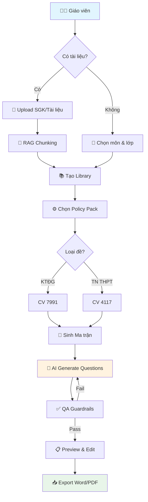
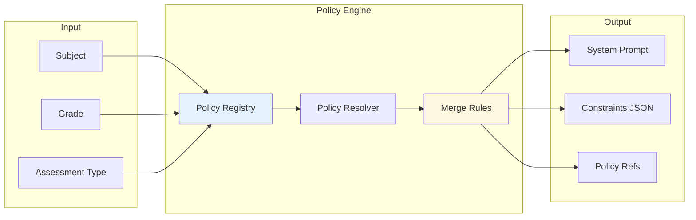
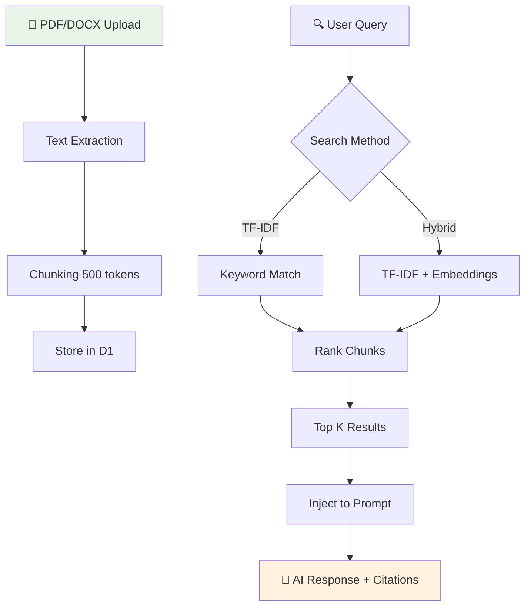

# 🎓 Kiến Tạo Việt - Hệ thống Tạo Đề Thi AI

> Nền tảng AI-powered cho giáo viên Việt Nam: Soạn đề chuẩn ma trận, tích hợp RAG từ SGK, tuân thủ CV 7991/4117.

[](https://exam-matrix-api.stu725114073.workers.dev)
[](https://kientaoviet.pages.dev)
[](LICENSE)

---

## 📋 Mục lục

- [Tính năng](#-tính-năng)
- [Kiến trúc](#-kiến-trúc)
- [Flowcharts](#-flowcharts)
- [Cài đặt](#-cài-đặt)
- [API Endpoints](#-api-endpoints)
- [Tech Stack](#-tech-stack)
- [Roadmap](#-roadmap)

---

## ✨ Tính năng

### 🎯 Core Features

| Feature | Mô tả |
|---------|-------|
| **Ma trận Đa Công Văn** | Hỗ trợ CV 7991 (KTĐG) và CV 4117 (TN THPT) với Policy Engine tự động |
| **RAG Context** | Upload SGK, AI đọc và trích dẫn từ tài liệu gốc |
| **BYOK (Bring Your Own Key)** | Dùng API key riêng từ OpenRouter, Google, OpenAI |
| **Citations** | Mỗi câu hỏi đính kèm nguồn trích dẫn |
| **Hybrid Search** | TF-IDF + Embeddings để tìm kiếm ngữ nghĩa |

### 📚 Modules

```
┌─────────────────┬─────────────────┬─────────────────┐
│   Exam Matrix   │   Lesson Plan   │      SKKN       │
│   (Ma trận đề)  │  (Kế hoạch bài) │ (Sáng kiến KN)  │
├─────────────────┼─────────────────┼─────────────────┤
│   QA Guardrails │    AI Hub       │   Community     │
│  (Kiểm tra CL)  │ (Đào tạo AI)    │  (Cộng đồng)    │
└─────────────────┴─────────────────┴─────────────────┘
```

---

## 🏗 Kiến trúc

```
┌───────────────────────────────────────────────────────────────────┐
│                         Frontend (React + Vite)                    │
│  ┌──────────┐ ┌──────────┐ ┌──────────┐ ┌──────────┐ ┌──────────┐ │
│  │CreateExam│ │ Settings │ │ Library  │ │  AI Hub  │ │Community │ │
│  └────┬─────┘ └────┬─────┘ └────┬─────┘ └────┬─────┘ └────┬─────┘ │
└───────┼────────────┼────────────┼────────────┼────────────┼───────┘
        │            │            │            │            │
        ▼            ▼            ▼            ▼            ▼
┌───────────────────────────────────────────────────────────────────┐
│                    API Gateway (Cloudflare Workers)                │
│  ┌─────────────────────────────────────────────────────────────┐  │
│  │                         Hono Router                          │  │
│  ├──────────┬──────────┬──────────┬──────────┬─────────────────┤  │
│  │  /exams  │   /rag   │/policies │/lessonpl │     /skkn       │  │
│  │  /libs   │ /context │ /packs   │  /qa     │   /ai-hub       │  │
│  └──────────┴──────────┴──────────┴──────────┴─────────────────┘  │
└───────────────────────────────────────────────────────────────────┘
        │            │            │            │
        ▼            ▼            ▼            ▼
┌───────────────────────────────────────────────────────────────────┐
│                      Cloudflare Infrastructure                     │
│  ┌─────────┐  ┌─────────┐  ┌─────────┐  ┌─────────────────────┐  │
│  │   D1    │  │   R2    │  │   KV    │  │   Durable Objects   │  │
│  │(SQLite) │  │(Storage)│  │ (Cache) │  │  (Collaboration)    │  │
│  └─────────┘  └─────────┘  └─────────┘  └─────────────────────┘  │
└───────────────────────────────────────────────────────────────────┘
```

---

## 📊 Flowcharts

### Quy trình tạo đề thi



### Luồng xử lý Policy Context



### RAG Pipeline



### BYOK Authentication Flow


---

## 🚀 Cài đặt

### Prerequisites

- Node.js >= 18
- pnpm >= 8
- Cloudflare account (for deployment)

### Local Development

```bash
# Clone repo
git clone https://github.com/LongNgn204/taodeonline.git
cd taodeonline

# Install dependencies
pnpm install

# Start dev servers
pnpm dev              # All packages
pnpm --filter web dev # Frontend only
pnpm --filter api dev # Backend only
```

### Environment Variables

```bash
# apps/web/.env.local
VITE_API_URL=http://localhost:8787

# apps/api/.dev.vars
ENVIRONMENT=development
```

### Database Migrations

```bash
cd apps/api

# Local
npx wrangler d1 execute DB --file=../../migrations/0001_init.sql

# Remote (production)
npx wrangler d1 execute DB --remote --file=../../migrations/0001_init.sql
```

---

## 📡 API Endpoints

### Core APIs

| Method | Endpoint | Description |
|--------|----------|-------------|
| `GET` | `/` | Health check |
| `POST` | `/auth/login` | Đăng nhập |
| `POST` | `/auth/register` | Đăng ký |

### Library & Documents

| Method | Endpoint | Description |
|--------|----------|-------------|
| `GET` | `/libraries` | Danh sách thư viện |
| `POST` | `/libraries` | Tạo thư viện mới |
| `POST` | `/documents/upload` | Upload tài liệu |

### Exam Generation

| Method | Endpoint | Description |
|--------|----------|-------------|
| `GET` | `/policy-context` | Lấy policy context |
| `POST` | `/rag/context` | RAG retrieval |
| `POST` | `/rag/hybrid-search` | Hybrid search |
| `POST` | `/validate/exam` | Validate exam |

### New Modules (L1-L4)

| Method | Endpoint | Description |
|--------|----------|-------------|
| `GET/POST` | `/lessonplans` | Kế hoạch bài dạy |
| `GET/POST` | `/skkn` | Sáng kiến kinh nghiệm |
| `POST` | `/qa/check` | QA Guardrails |
| `POST` | `/qa/check-safety` | Content safety |

---

## 🛠 Tech Stack

### Frontend
- **React 18** + TypeScript
- **Vite** - Build tool
- **TailwindCSS** - Styling
- **Lucide** - Icons
- **Framer Motion** - Animations

### Backend
- **Cloudflare Workers** - Serverless
- **Hono** - Web framework
- **D1** - SQLite database
- **R2** - Object storage
- **Durable Objects** - Real-time collaboration

### AI/ML
- **OpenRouter** - Multi-model gateway
- **Google Gemini** - Primary model
- **TF-IDF** - Text retrieval
- **Embeddings** - Semantic search (optional)

### Packages (Monorepo)
```
packages/
├── core/       # Policy registry, types
├── rag/        # Chunking, retrieval
└── docx/       # Word export
```

---

## 🗺 Roadmap

### ✅ Completed (Dec 2024)

- [x] Policy Context API (CV 7991, CV 4117)
- [x] RAG Context với citations
- [x] Hybrid Search (TF-IDF + Embeddings)
- [x] Lesson Plan module
- [x] SKKN module
- [x] QA + Guardrails
- [x] AI Hub với 8 courses

### 🔜 Upcoming

- [ ] Vector embeddings với AI Gateway
- [ ] Collaboration real-time editing
- [ ] Mobile app (React Native)
- [ ] LMS integration (Moodle, Canvas)

---

## 📝 License

MIT License - xem [LICENSE](LICENSE) để biết thêm chi tiết.

---

## 🤝 Đóng góp

Chúng tôi hoan nghênh mọi đóng góp! Vui lòng:

1. Fork repo
2. Tạo branch (`git checkout -b feature/amazing-feature`)
3. Commit (`git commit -m 'Add amazing feature'`)
4. Push (`git push origin feature/amazing-feature`)
5. Tạo Pull Request

---

<div align="center">
  <strong>Made with ❤️ for Vietnamese teachers</strong>
  <br>
  <sub>© 2024 Kiến Tạo Việt</sub>
</div>
