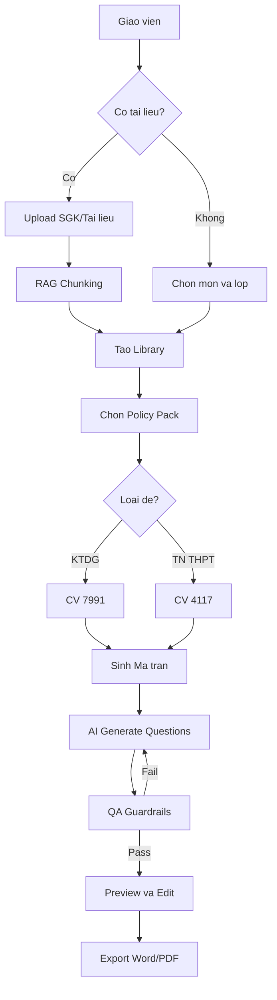
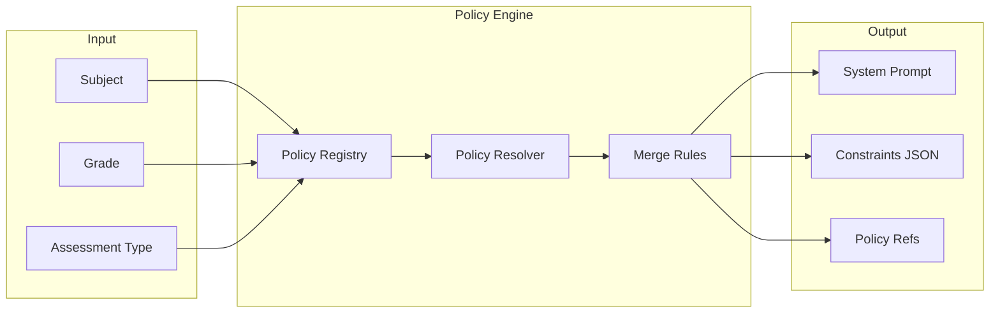
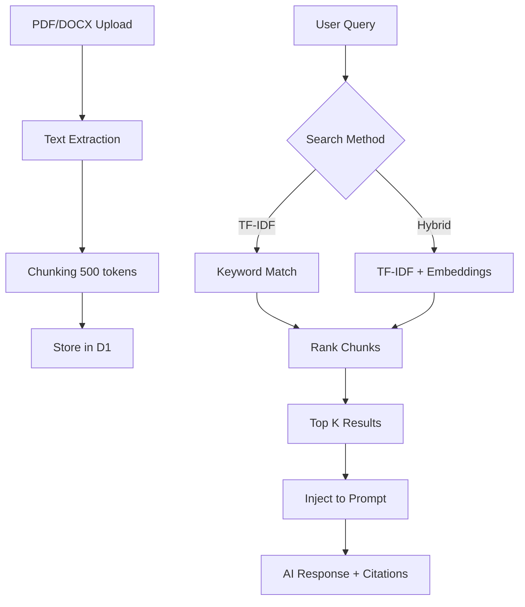
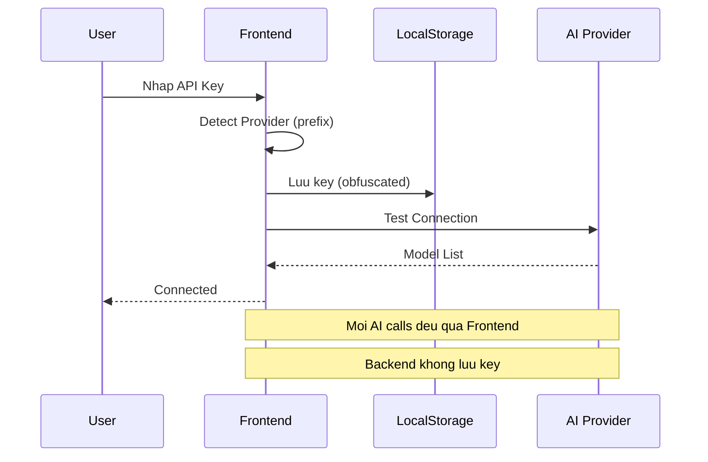

# Kien Tao Viet - He thong Tao De Thi AI

> Nen tang AI-powered cho giao vien Viet Nam: Soan de chuan ma tran, tich hop RAG tu SGK, tuan thu CV 7991/4117.

- Backend: Cloudflare Workers - https://exam-matrix-api.stu725114073.workers.dev
- Frontend: React + Vite - https://kientaoviet.pages.dev
- License: MIT

---

## Muc luc

- [Tinh nang](#tinh-nang)
- [Kien truc](#kien-truc)
- [Flowcharts](#flowcharts)
- [Huong dan Su dung](#huong-dan-su-dung)
- [Cai dat](#cai-dat)
- [API Endpoints](#api-endpoints)
- [Tech Stack](#tech-stack)
- [Roadmap](#roadmap)
- [Dong gop](#dong-gop)

---

## Tinh nang

### Core Features

| Feature               | Mo ta                                                                |
|-----------------------|----------------------------------------------------------------------|
| Ma tran Da Cong Van   | Ho tro CV 7991 (KTDG) va CV 4117 (TN THPT) voi Policy Engine tu dong |
| RAG Context           | Upload SGK, AI doc va trich dan tu tai lieu goc                      |
| BYOK (Bring Your Own Key) | Dung API key rieng tu OpenRouter, Google, OpenAI                 |
| Citations             | Moi cau hoi dinh kem nguon trich dan                                 |
| Hybrid Search         | TF-IDF + Embeddings de tim kiem ngu nghia                            |

### Modules

```
+------------------+------------------+------------------+
|   Exam Matrix    |   Lesson Plan    |      SKKN        |
|   (Ma tran de)   |  (Ke hoach bai)  | (Sang kien KN)   |
+------------------+------------------+------------------+
|   QA Guardrails  |    AI Hub        |   Community      |
|  (Kiem tra CL)   | (Dao tao AI)     |  (Cong dong)     |
+------------------+------------------+------------------+
```

---

## Kien truc

```
+--------------------------------------------------------------------+
|                         Frontend (React + Vite)                     |
|  +------------+ +------------+ +------------+ +----------+ +------+ |
|  | CreateExam | | Settings   | | Library    | | AI Hub   | |Comm. | |
|  +------+-----+ +------+-----+ +------+-----+ +----+-----+ +--+---+ |
+---------+-------------+-------------+-------------+------------+----+
          |             |             |             |            |
          v             v             v             v            v
+--------------------------------------------------------------------+
|                    API Gateway (Cloudflare Workers)                 |
|  +----------------------------------------------------------------+ |
|  |                         Hono Router                            | |
|  +----------+----------+----------+----------+--------------------+ |
|  |  /exams  |   /rag   |/policies |/lessonpl |     /skkn          | |
|  |  /libs   | /context | /packs   |  /qa     |   /ai-hub          | |
|  +----------+----------+----------+----------+--------------------+ |
+--------------------------------------------------------------------+
          |             |             |             |
          v             v             v             v
+--------------------------------------------------------------------+
|                      Cloudflare Infrastructure                      |
|  +-----------+  +-----------+  +-----------+  +-------------------+ |
|  |    D1     |  |    R2     |  |    KV     |  | Durable Objects   | |
|  | (SQLite)  |  | (Storage) |  |  (Cache)  |  | (Collaboration)   | |
|  +-----------+  +-----------+  +-----------+  +-------------------+ |
+--------------------------------------------------------------------+
```

---

## Flowcharts

### Quy trinh tao de thi



### Luong xu ly Policy Context



### RAG Pipeline



### BYOK Authentication Flow



---

## Huong dan Su dung

### 1. Dang ky va Dang nhap

#### 1.1. Dang ky tai khoan moi

1. Truy cap trang web: https://kientaoviet.pages.dev
2. Nhan nut "Dang ky" tren giao dien chinh
3. Nhap thong tin ca nhan:
   - Ho va ten
   - Email
   - Mat khau (toi thieu 6 ky tu)
4. Nhan "Dang ky" de hoan tat

#### 1.2. Dang nhap

1. Nhap email va mat khau da dang ky
2. Nhan "Dang nhap" de vao he thong
3. Sau khi dang nhap thanh cong, ban se duoc chuyen den Dashboard

---

### 2. Dashboard (Trang chu)

Dashboard hien thi tong quan hoat dong cua ban:

- Tong so de thi da tao
- So thu vien tai lieu
- Tien do hoc tap tuan nay
- Cac thao tac nhanh

---

### 3. Thu vien (Libraries)

#### 3.1. Tao thu vien moi

1. Truy cap menu "Thu vien"
2. Nhan nut "Tao thu vien moi"
3. Nhap ten thu vien va mo ta
4. Nhan "Luu" de tao

#### 3.2. Upload tai lieu

1. Vao thu vien da tao
2. Nhan "Them tai lieu"
3. Chon file PDF hoac Word tu may tinh
4. He thong se tu dong xu ly va chia nho tai lieu (chunking)
5. Tai lieu san sang de su dung voi RAG

---

### 4. Tao De Thi (Create Exam)

#### 4.1. Quy trinh 4 buoc tao de

**Buoc 1: Xac dinh Muc tieu va Noi dung**

1. Truy cap "Tao de moi"
2. Chon:
   - Mon hoc (Toan, Ngu van, Tieng Anh, ...)
   - Khoi lop (6-12)
   - Thoi gian lam bai (45 phut, 90 phut, ...)
   - Loai de: KTDG (CV 7991) hoac TN THPT (CV 4117)
3. Xac dinh cac chuong/bai can kiem tra

**Buoc 2: Xay dung Ma tran (Matrix)**

He thong tu dong hien thi bang ma tran voi 3 muc do nhan thuc:

| Muc do         | Ti le mac dinh |
|----------------|----------------|
| Nhan biet (NB) | 40%            |
| Thong hieu (TH)| 30%            |
| Van dung (VD)  | 30%            |

Ban co the chinh sua ti le theo yeu cau.

**Buoc 3: Bien soan va Sinh de**

- Cach 1: Nhap cau hoi thu cong
- Cach 2: Su dung AI Hub de sinh cau hoi tu dong
- Cach 3: Su dung tinh nang Digitize de so hoa cau hoi tu file Word/PDF

**Buoc 4: Xuat ban va Bao cao**

1. Xem truoc de thi
2. Chinh sua neu can
3. Xuat de thi ra file Word hoac PDF
4. He thong tu dong tao Bang dac ta di kem

#### 4.2. Su dung RAG Context

Khi da upload tai lieu vao thu vien, ban co the:

1. Tich chon "Su dung tai lieu tham khao"
2. Chon thu vien chua tai lieu lien quan
3. AI se tu dong trich dan noi dung tu tai lieu khi sinh cau hoi
4. Moi cau hoi se co citation tra ve nguon goc

---

### 5. Ke hoach Bai day (Lesson Plan)

#### 5.1. Tao ke hoach bai day moi

1. Truy cap menu "Ke hoach bai day"
2. Nhan "Tao ke hoach moi"
3. Nhap thong tin:
   - Ten bai hoc
   - Mon hoc va khoi lop
   - Muc tieu bai hoc
   - Thoi luong
4. Su dung AI de goi y noi dung bai giang
5. Luu va xuat ra file Word

---

### 6. Sang kien Kinh nghiem (SKKN)

#### 6.1. Tao SKKN

1. Truy cap menu "Sang kien KN"
2. Nhan "Tao sang kien moi"
3. Nhap cac thong tin:
   - Ten sang kien
   - Linh vuc ap dung
   - Mo ta van de
   - Giai phap de xuat
4. Su dung AI de ho tro bien soan noi dung
5. Xuat SKKN ra file Word

---

### 7. AI Hub (Trung tam hoc AI)

AI Hub cung cap cac khoa hoc ve su dung AI trong giang day:

1. Truy cap menu "AI Hub"
2. Chon khoa hoc phu hop:
   - Co ban ve Prompt Engineering
   - Su dung AI sinh cau hoi
   - Kiem tra dap an bang AI
   - Va nhieu khoa hoc khac
3. Hoan thanh bai tap de nhan chung chi

---

### 8. Cai dat (Settings)

#### 8.1. Cau hinh API Key (BYOK)

1. Truy cap "Cai dat" > "API Key"
2. Nhap API key tu nha cung cap:
   - OpenRouter: bat dau bang "sk-or-..."
   - Google AI: bat dau bang "AI..."
   - OpenAI: bat dau bang "sk-..."
3. Nhan "Luu" de xac nhan
4. He thong se tu dong kiem tra ket noi

#### 8.2. Cau hinh khac

- Thay doi mat khau
- Cap nhat thong tin ca nhan
- Quan ly thong bao

---

### 9. Cong dong (Community)

1. Truy cap menu "Cong dong"
2. Xem cac de thi duoc chia se
3. Tai ve de thi mau
4. Chia se de thi cua ban voi cong dong

---

### 10. Phan tich De thi (Analytics)

1. Truy cap "Phan tich" tu Dashboard
2. Xem cac thong ke:
   - Do kho thuc te cua de thi
   - Phan tich pho diem du kien
   - Thong ke theo muc do nhan thuc

---

## Cai dat

### Yeu cau he thong

- Node.js >= 18
- pnpm >= 8
- Cloudflare account (cho deployment)

### Chay Local

```bash
# Clone repo
git clone https://github.com/LongNgn204/taodeonline.git
cd taodeonline

# Cai dat dependencies
pnpm install

# Chay tat ca packages
pnpm dev

# Chi chay Frontend
pnpm --filter web dev

# Chi chay Backend
pnpm --filter api dev
```

### Bien moi truong

```bash
# apps/web/.env.local
VITE_API_URL=http://localhost:8787

# apps/api/.dev.vars
ENVIRONMENT=development
```

### Database Migrations

```bash
cd apps/api

# Local
npx wrangler d1 execute DB --file=../../migrations/0001_init.sql

# Remote (production)
npx wrangler d1 execute DB --remote --file=../../migrations/0001_init.sql
```

---

## API Endpoints

### Core APIs

| Method | Endpoint        | Mo ta          |
|--------|-----------------|----------------|
| GET    | /               | Health check   |
| POST   | /auth/login     | Dang nhap      |
| POST   | /auth/register  | Dang ky        |

### Library va Documents

| Method | Endpoint            | Mo ta                |
|--------|---------------------|----------------------|
| GET    | /libraries          | Danh sach thu vien   |
| POST   | /libraries          | Tao thu vien moi     |
| POST   | /documents/upload   | Upload tai lieu      |

### Exam Generation

| Method | Endpoint            | Mo ta                |
|--------|---------------------|----------------------|
| GET    | /policy-context     | Lay policy context   |
| POST   | /rag/context        | RAG retrieval        |
| POST   | /rag/hybrid-search  | Hybrid search        |
| POST   | /validate/exam      | Validate exam        |

### New Modules (L1-L4)

| Method   | Endpoint      | Mo ta                  |
|----------|---------------|------------------------|
| GET/POST | /lessonplans  | Ke hoach bai day       |
| GET/POST | /skkn         | Sang kien kinh nghiem  |
| POST     | /qa/check     | QA Guardrails          |
| POST     | /qa/check-safety | Content safety      |

---

## Tech Stack

### Frontend

- React 18 + TypeScript
- Vite - Build tool
- TailwindCSS - Styling
- Lucide - Icons
- Framer Motion - Animations

### Backend

- Cloudflare Workers - Serverless
- Hono - Web framework
- D1 - SQLite database
- R2 - Object storage
- Durable Objects - Real-time collaboration

### AI/ML

- OpenRouter - Multi-model gateway
- Google Gemini - Primary model
- TF-IDF - Text retrieval
- Embeddings - Semantic search (optional)

### Packages (Monorepo)

```
packages/
+-- core/       # Policy registry, types
+-- rag/        # Chunking, retrieval
+-- docx/       # Word export
```

---

## Roadmap

### Hoan thanh (Dec 2024)

- [x] Policy Context API (CV 7991, CV 4117)
- [x] RAG Context voi citations
- [x] Hybrid Search (TF-IDF + Embeddings)
- [x] Lesson Plan module
- [x] SKKN module
- [x] QA + Guardrails
- [x] AI Hub voi 8 courses

### Sap toi

- [ ] Vector embeddings voi AI Gateway
- [ ] Collaboration real-time editing
- [ ] Mobile app (React Native)
- [ ] LMS integration (Moodle, Canvas)

---

## License

MIT License - xem [LICENSE](LICENSE) de biet them chi tiet.

---

## Dong gop

Chung toi hoan nghenh moi dong gop! Vui long:

1. Fork repo
2. Tao branch (`git checkout -b feature/amazing-feature`)
3. Commit (`git commit -m 'Add amazing feature'`)
4. Push (`git push origin feature/amazing-feature`)
5. Tao Pull Request

---

Made with love for Vietnamese teachers

(c) 2024 Kien Tao Viet
